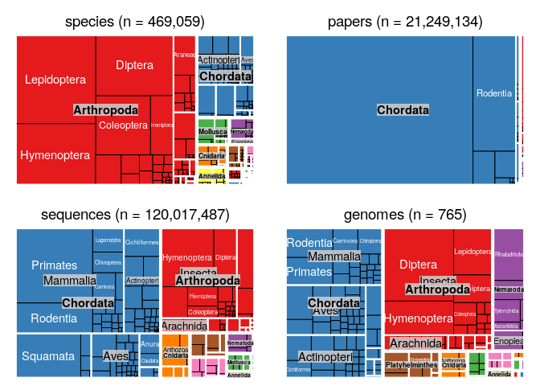

# rentrez An R pacakge for the NCBI eutils API


## Introduction

The USA National Center for Biotechnology Information (NCBI) is one of the world's 
largest and most important sources of biological data. At the time of writing, the NCBI
PubMed database provided information on $27.5$ million journal
articles, including $4.5$ million full text records. The NCBI
Nucleotide Database (including GenBank) had data for $242.3$ million different sequences and dbSNP described $997.3$ 
million different genetic variants. Records from all of these databases can be 
cross-referenced with the  $1.3$ 
million species in the NCBI taxonomy, and PubMed entries can be searched for using a 
controlled vocabulary containing $272$ thousand unique terms. 

The NCBI provides access to a total of $50$ databases 
through a web interface,public FTP sites and a REST API called Entrez Programming Utilities (EUtils). A
number of R packages from the Bioconductor project (e.g., \\BIOpkg{genomes}, 
\\BIOpkg{RMassBank} and \\BIOpkg{MeSHSim}) or available from CRAN 
(e.g., \\CRANpkg{ape}, \\CRANpkg{RISmed} and \\CRANpkg{pubmed.mineR}) 
take advantage of the Eutils API to perform specific tasks. Two packages,
\\CRANpkg{rentrez} and \\CRANpkg{reutils}, provide functions that cover the entire 
API.  

Here I describe \\pkg{rentrez}, a package which provides users with a simple and
consistent interface to EUtils. In this paper I describe the design of the package, 
illustrate its use in biological research and demonstrate how the functions provided by \\pkg{rentrez}
can aid the development of other packages designed to meet more specific goals.


## The EUtils API and \\\\pkg{rentrez}

The EUtils API provides endpoints for searching each of the databases it covers, 
finding cross-references among records in those databases and fetching 
particular records (in complete or summary form). The design of \\pkg{rentrez} 
mirrors that of EUtils, with each of these endpoints represented by a core
function that has arguments named to match those used in the API documentation
(Table \\ref{tab:core-ends}). The most important arguments to the R functions are
documented, and each ofthe help pages contains a reference to relevant section of the 
EUtils documentation to give users detailed information on how to make the most
of each endpoint.

\\begin{table}[]
\\centering
\\caption{Core EUtils endpoints and their \\pkg{rentrez} counterparts}
\\label{tab:core-ends}
\\begin{tabular}{llll}
\\hline
NCBI endpoint & Purpose                                         & Core function   \\\\ \\hline
esearch       & Locate records matching search criteria.        & \\texttt{entrez\\_search}  \\\\ 
elink         & Discover of cross-linked records.               & \\texttt{entrez\\_link}    \\\\ 
esummary      & Fetch summary data on a set of records.         & \\texttt{entrez\\_summary} \\\\ 
efetch        & Fetch complete records in a variety of formats. & \\texttt{entrez\\_fetch}   \\\\ \\hline
\\end{tabular}
\\end{table}


Typically, a user will begin by using `entrez_search` to discover unique
identifiers for database records matching particular criteria. For example, the
following call takes advantage of the EUtils search syntax (which is described in the
functoin's help page) to discover scientific papers that were published in 2017 
and contain the phrase "R Package" in their title.


```r
pubmed_search <- entrez_search(db="pubmed", 
                               term="(R package[TITL]) AND 2017[PDAT]", 
                               use_history=TRUE)
pubmed_search
```

```
## Entrez search result with 62 hits (object contains 20 IDs and a web_history object)
##  Search term (as translated):  R package[TITL] AND 2017[PDAT]
```

The object returned by `entrez_search` can contain identifiers for records that
match the given search term or a `web_history` object that serves as a reference 
to a set of identifiers stored on the NCBI's servers. Identifiers or
`web_history` objects can be passed to the other core functions to retrieve
information about the records they represent. For example, a call to
`entrez_summary` returns information about each paper identified in the search
above.


```r
pkg_paper_summs <- entrez_summary(db="pubmed", web_history=pubmed_search$web_history)
pkg_paper_summs
```

```
## List of  62 esummary records. First record:
## 
##  $`28759592`
## esummary result with 42 items:
##  [1] uid               pubdate           epubdate         
##  [4] source            authors           lastauthor       
##  [7] title             sorttitle         volume           
## [10] issue             pages             lang             
## [13] nlmuniqueid       issn              essn             
## [16] pubtype           recordstatus      pubstatus        
## [19] articleids        history           references       
## [22] attributes        pmcrefcount       fulljournalname  
## [25] elocationid       doctype           srccontriblist   
## [28] booktitle         medium            edition          
## [31] publisherlocation publishername     srcdate          
## [34] reportnumber      availablefromurl  locationlabel    
## [37] doccontriblist    docdate           bookname         
## [40] chapter           sortpubdate       sortfirstauthor
```

In addition to matching each of the EUtils endpoints, \\pkg{rentrez} provides a
number of utility functions that facilitate common workflows. For example, the
function \\texttt{extract_from_summary} allows users to extract some subset of
the items from each of the summary records. In this case, the names of the 
journals in which these papers appeared can be isolated.


```r
journals <- extract_from_esummary(pkg_paper_summs, "fulljournalname")
head(journals,3)
```

```
##                                      28759592 
##                  "PLoS computational biology" 
##                                      28750623 
##                          "BMC bioinformatics" 
##                                      28724433 
## "International journal of health geographics"
```

## Demonstration: retrieving unique transcripts for a given gene

The package includes an extensive vignette, which can be accessed from within an
R session by typing `vignette(topic="rentrez_tutorial")`. This document combines
extensive documentation on each of the EUtils endpoints with detailed workflows
that combine different \\pkg{rentrez} functions to analyse biological data. Here
I add an additional demonstration, illustrating how \\pkg{rentrez} can
automate the process of retrieving DNA sequence data corresponding to mRNA
transcripts produced from a given gene.

We start by assuming a user wishes to retrieve the sequence of mRNA transcripts 
associated with the gene that encodes Amyloid Beta Precursor Portein in humans, 
and that they know this gene has the gene symbol `APP`. With this information 
available, the first step to acquiring the DNA sequence data is identifying the 
correct gene in the NCBI's Gene database. This can be achieved using `entrez_search`.


```r
app_gene <- entrez_search(db="gene", term="(Homo sapiens[ORGN]) AND APP[GENE]")
app_gene
```

```
## Entrez search result with 1 hits (object contains 1 IDs and no web_history object)
##  Search term (as translated):  "Homo sapiens"[Organism] AND APP[GENE]
```

The object returned here contains the unique identifier for a record in the Gene
database. Our goal is to obtain sequence data, which is stored in the
Nucleotide database. The function `entrez_link` can be used to find 
records in one database that correspond to entries in another. In this case, a
single call to `entrez_link` can identify human APP sequences in the nucleotide
database in general and a number of restrictive subsets of that database in
particular.


```r
nuc_links <- entrez_link(dbfrom='gene', id=app_gene$ids, db='nuccore')
nuc_links$links
```

```
## elink result with information from 5 databases:
## [1] gene_nuccore            gene_nuccore_mgc        gene_nuccore_pos       
## [4] gene_nuccore_refseqgene gene_nuccore_refseqrna
```

The goal here is to identify unique mRNA transcripts associate with our gene of
interest. The `refseqrna` subset on the Nucleotide database is thus the
appropriate set of sequences to download. The function `entrez_fetch` allows
users to retrieve complete records in a variety for formats. Here the sequences
are retrieved in the standard fasta format, and returned as a character vector
with a single element.


```r
raw_recs <- entrez_fetch(db="nuccore", id=nuc_links$links$gene_nuccore_refseqrna, rettype="fasta")
cat(substr(raw_recs, 1,306), "\\n...\\n")
```

```
## >NM_001136131.2 Homo sapiens amyloid beta precursor protein (APP), transcript variant 7, mRNA
## GTCGGATGATTCAAGCTCACGGGGACGAGCAGGAGCGCTCTCGACTTTTCTAGAGCCTCAGCGTCCTAGG
## ACTCACCTTTCCCTGATCCTGCACCGTCCCTCTCCTGGCCCCAGACTCTCCCTCCCACTGTTCACGAAGC
## CCAGGTACCCACTGATGGTAATGCTGGCCTGCTGGCTGAACCCCAGATTGCCATGTTCTGTGGCAGACTG \n...\n
```

Sequences retrieved in this way could be written to file using `write`.
Alternatively, they could be analysed  within R using packages designed for
sequence data. For instance, the data base be represented as a `DNAbin` object
using the phylogentics package \\CRANpkg{ape}.


```r
tf <- tempfile()
cat(raw_recs,file= tf)
ape::read.dna(tf, format="fasta")
```

```
## 10 DNA sequences in binary format stored in a list.
## 
## Mean sequence length: 3477.9 
##    Shortest sequence: 3255 
##     Longest sequence: 3648 
## 
## Labels:
## NM_001136131.2 Homo sapiens amyloid beta precursor protein (...
## NM_001136016.3 Homo sapiens amyloid beta precursor protein (...
## NM_001204303.1 Homo sapiens amyloid beta precursor protein (...
## NM_001204301.1 Homo sapiens amyloid beta precursor protein (...
## NM_001204302.1 Homo sapiens amyloid beta precursor protein (...
## NM_201414.2 Homo sapiens amyloid beta precursor protein (APP...
## ...
## 
## Base composition:
##     a     c     g     t 
## 0.276 0.223 0.258 0.244
```

## Demonstration: development of a new package

Development of \\pkg{rentrez} has deliberately focused on producing a "low-level"
package that provides a flexible interface to the entire the EUtils API. As a 
result the package does not provide functions for any particular analysis
or return records in any of the object classes made available for biological
data by other packages. Rather, it is hoped that by providing a reliable interface
to the EUtils API that meets the NCBI's terms of use \\\\pkg{rentrez} will allow
developers ...


```r
devtools::load_all("tidytaxon")
```

```
## Loading tidytaxon
```

```r
animal_orders <- tidy_taxonomy("animals", 
                               lowest_rank="order",
                               higher_ranks=c("phylum", "class"))

animal_orders$spp <- taxon_children(animal_orders$order)
animal_orders$genomes <- taxon_records(animal_orders$order, db="genome")
animal_orders$sequences <- taxon_records(animal_orders$order, db="nuccore")
animal_orders$papers <- taxon_records(animal_orders$order, db="pubmed")
head(animal_orders,3)
```

```
##     phylum          class         order spp genomes sequences papers
## 1 Annelida     Clitellata  Enchytraeida   1       0         6      1
## 2 Chordata           Aves Cariamiformes   2       1     98622      0
## 3 Porifera Hexactinellida Aulocalycoida   3       0        10      1
```

```r
write.csv(animal_orders, file="animal_data.csv", row.names=FALSE)
```


```r
library(treemap)
library(grid)
library(gridExtra)

#Create a common colour palette for both plots. 
spp_by_phyl <- aggregate(spp ~ phylum, FUN=sum, data=animal_orders)
phyla <- spp_by_phyl$phylum[ order(spp_by_phyl$spp, decreasing=TRUE)]
pal <- structure( rep(RColorBrewer::brewer.pal(name="Set1", n=8),3), .Names=phyla)
animal_orders$fill <- pal[ animal_orders$phylum ]

                 
grid.newpage()
pushViewport(viewport(layout = grid.layout(2, 2)))


treemap(animal_orders, 
        index=c("phylum", "class", "order"), vSize="spp", vColor="fill", 
        palette=pal, type='categorical', position.legend="none", 
        title=paste0("Number of species (n = ", sum(animal_orders$spp), ")"),       
        border.col=c("white","white","black"),
        vp = viewport(layout.pos.row = 1, layout.pos.col = 1)
)
```

```
## Warning in `[.data.table`(dtfDT, , `:=`("c", fact), with = FALSE):
## with=FALSE ignored, it isn't needed when using :=. See ?':=' for examples.
```

```r
treemap(animal_orders, 
        index=c("phylum", "class", "order"), vSize="papers", vColor="fill", 
        palette=pal, type='categorical', position.legend="none", 
        title=paste0("Number of papers (n = ", sum(animal_orders$papers), ")"),       
        border.col=c("white","white","black"),
        vp = viewport(layout.pos.row = 1, layout.pos.col = 2)
)
```

```
## Warning in `[.data.table`(dtfDT, , `:=`("c", fact), with = FALSE):
## with=FALSE ignored, it isn't needed when using :=. See ?':=' for examples.
```

```r
treemap(animal_orders, 
        index=c("phylum", "class", "order"), vSize="sequences", vColor="fill", 
        palette=pal, type='categorical', position.legend="none", 
        title=paste0("Number of sequences (n = ", sum(animal_orders$sequences), ")"),       
        border.col=c("white","white","black"),
        vp = viewport(layout.pos.row = 2, layout.pos.col = 1)
)
```

```
## Warning in `[.data.table`(dtfDT, , `:=`("c", fact), with = FALSE):
## with=FALSE ignored, it isn't needed when using :=. See ?':=' for examples.
```

```r
treemap(animal_orders, 
        index=c("phylum", "class", "order"), vSize="genomes", vColor="fill", 
        palette=pal, type='categorical', position.legend="none",
        title=paste0("Number of genomes (n = ", sum(animal_orders$genomes), ")"),       
        border.col=c("white","white","black"),
        vp = viewport(layout.pos.row = 2, layout.pos.col = 2)
)      
```

```
## Warning in `[.data.table`(dtfDT, , `:=`("c", fact), with = FALSE):
## with=FALSE ignored, it isn't needed when using :=. See ?':=' for examples.
```

<!-- -->


\\bibliography{RJreferences}
